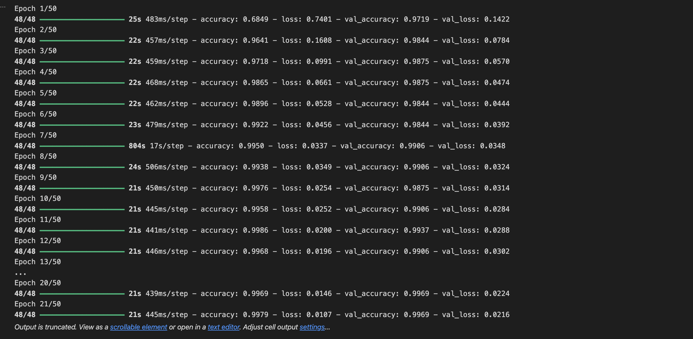
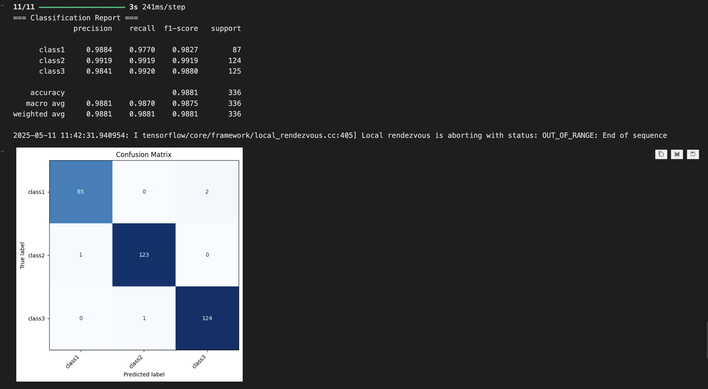

# Rock-Paper-Scissors Classification Project 🪨📄✂️

**Cut Sula Fhatia Rahma**  (2208107010048)
---

## 📚 Deskripsi Proyek

Proyek ini bertujuan untuk membangun sistem klasifikasi gambar sederhana menggunakan **Deep Learning** dengan arsitektur **Transfer Learning** (menggunakan MobileNetV2).  
Gambar yang diklasifikasikan terdiri dari tiga kategori: **Rock**, **Paper**, dan **Scissors**.

Model yang dilatih kemudian akan diintegrasikan ke dalam aplikasi backend berbasis **FastAPI**, sehingga bisa menerima gambar dan memberikan hasil prediksi secara real-time.

---

## 🛠️ Teknologi yang Digunakan

- **TensorFlow / Keras** — Untuk membangun dan melatih model klasifikasi gambar.
- **FastAPI** — Untuk membangun backend REST API.
- **Uvicorn** — Sebagai ASGI server untuk menjalankan FastAPI.
- **PIL (Pillow)** — Untuk memproses gambar.
- **NumPy** — Untuk manipulasi data numerik.
- **scikit-learn** — Untuk evaluasi model (classification report, confusion matrix).

---

## 📂 Struktur Folder Proyek

```
Tugas3-Pembelajaran_Machine_Learning/
├── backend/
│   ├── main.py         # Kode backend FastAPI
│   └──requirements.txt
├── frontend/
│   ├── main.py         # Kode frontend UI
│   └──requirements.txt          
├── model/
│   └── best_transfer.keras # Model hasil training yang disimpan
├── dataset/
│   ├── rock/
│   ├── paper/
│   └── scissor/
└── README.md
```

---

## 🚀 Langkah Penggunaan

### 1. Clone Repository

git clone https://github.com/csulafr/Tugas-3_Cut-Sula-Fhatia-Rahma_2208107010048.git <br>
cd Tugas-3_Cut-Sula-Fhatia-Rahma_2208107010048

### 2. Siapkan Environment Python

Disarankan menggunakan **Python 3.9–3.11**.

Buat environment baru, lalu install dependencies:

pip install -r requirements.txt

### 3. Dataset

Dataset diunduh dari Kaggle (Rock-Paper-Scissors) :  
🔗 [Rock-Paper-Scissors Dataset – Kaggle](https://www.kaggle.com/datasets/drgfreeman/rockpaperscissors)

Struktur folder dataset seperti ini :

dataset/
    rock/
    paper/
    scissor/

### 4. Menjalankan Program

Masuk ke folder `frontend/`, lalu jalankan:

`streamlit run app.py`

Streamlit akan berjalan di `http://localhost:8501/`

Kemudian, masuk ke folder `backend/`, lalu jalankan:

`uvicorn main:app --host 0.0.0.0 --port 8000 --reload`

Server akan berjalan di `http://localhost:8000/`.

---

## 🎯 Tujuan Pembelajaran

- Memahami alur kerja training dan deployment model machine learning.
- Membiasakan diri mengintegrasikan model ke dalam aplikasi backend nyata.
- Melatih kerapihan penyusunan struktur proyek dan dokumentasi.

---

## 📋 Hasil Model dan Tampilan Frontend

- Training Model <br>


- Evaluasi Model <br>


- Evaluasi Model <br>
.png) <br>
.png)

---
